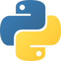
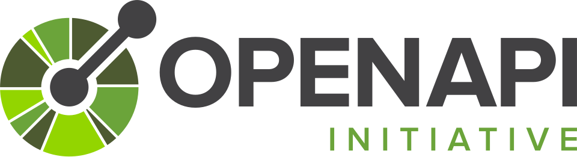
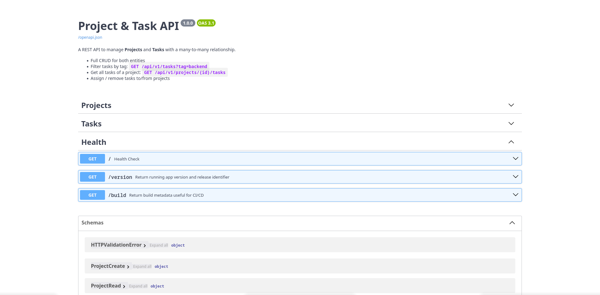
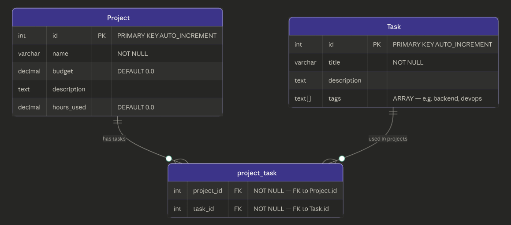
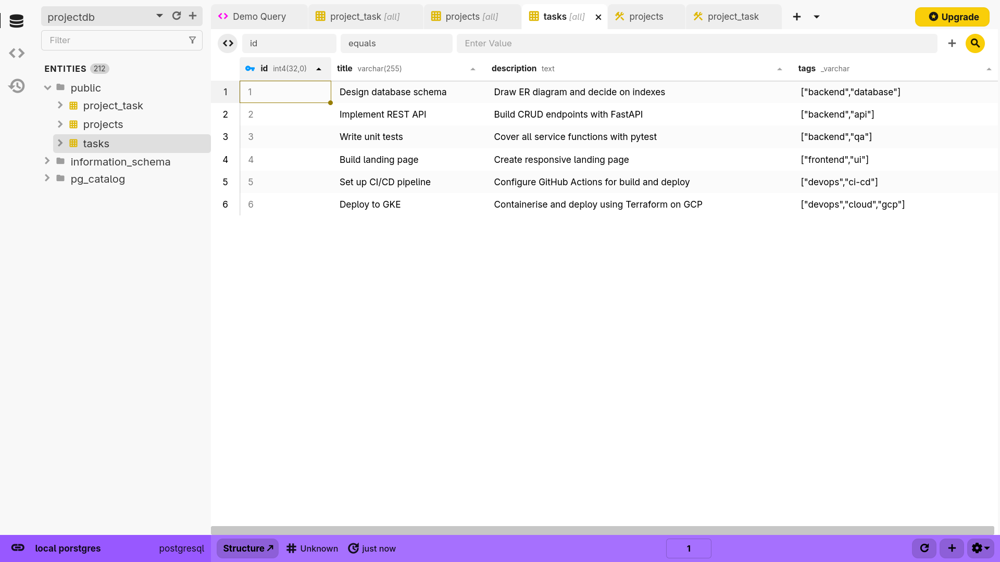
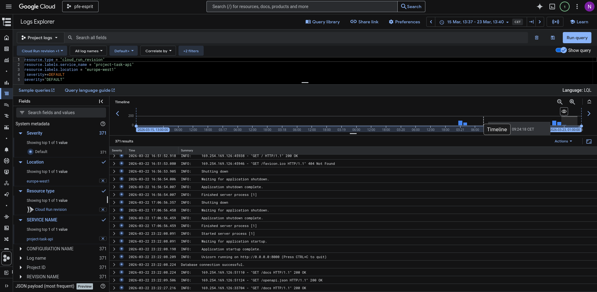

<h1 align="center">⚡ Project Task API</h1>

<p align="center">
  A production-ready REST API for managing <b>Projects</b> and <b>Tasks</b>.
</p>

<p align="center">
  
  &nbsp;
  
  &nbsp;
  
  &nbsp;
  
  &nbsp;
  
  &nbsp;
  
  &nbsp;
  
</p>

<p align="center">
  <a href="#-quickstart">Quickstart</a> ·
  <a href="#-api-endpoints">Endpoints</a> ·
  <a href="#-architecture">Architecture</a> ·
  <a href="#-design-decisions--trade-offs">Design Decisions</a> ·
  <a href="#️-cicd--gcp-deployment">Deployment</a>
</p>

> **Assignment by Nidhal Naffati** — [nidhalnaffati.dev](https://nidhalnaffati.dev) · nidhalnaffati@gmail.com · Last updated: 2026-03-22

---

## 🌐 Live deployment

The API is deployed and running on **GCP Cloud Run** — no local setup needed to explore it:

| Interface | URL |
|---|---|
| 🟢 Health check | https://project-task-api-jzrcrw37nq-ew.a.run.app/ |
| 📖 Swagger UI | https://project-task-api-jzrcrw37nq-ew.a.run.app/docs |
| 📄 ReDoc | https://project-task-api-jzrcrw37nq-ew.a.run.app/redoc |

---

## Contents

- [What this service does](#-what-this-service-does)
- [Quickstart](#-quickstart)
- [Architecture](#-architecture)
- [API endpoints](#-api-endpoints)
- [Database model](#️-database-model)
- [Design decisions & trade-offs](#-design-decisions--trade-offs)
- [Testing](#-testing)
- [CI/CD & GCP deployment](#️-cicd--gcp-deployment)
- [Repository structure](#-repository-structure)
- [If this were production](#-if-this-were-production)

---

## 📌 What this service does

A REST API to manage **Projects**, **Tasks**, and the **many-to-many relationship** between them. A task can belong to multiple projects; projects expose their task list directly.

| Requirement | Implemented via | Location |
|---|---|---|
| CRUD Projects | `GET/POST/PATCH/DELETE /api/v1/projects/` | `app/api/v1/endpoints/projects.py` |
| CRUD Tasks | `GET/POST/PATCH/DELETE /api/v1/tasks/` | `app/api/v1/endpoints/tasks.py` |
| Filter tasks by tag | `GET /api/v1/tasks/?tag=backend` | `task_service.get_by_tag()` |
| Tasks for a project | `GET /api/v1/projects/{id}/tasks` | `project_service.get_tasks()` |
| Many-to-many (Task ↔ Project) | `project_task` association table | `app/models/models.py` |
| Docker + Compose | `docker compose up --build` | `Dockerfile`, `docker-compose.yml` |

---

## 🚀 Quickstart

### Option A — Live (no setup needed)

The API is already deployed on GCP Cloud Run. You can explore and call it directly:

```bash
# Filter tasks by tag — no local setup required
curl -s 'https://project-task-api-jzrcrw37nq-ew.a.run.app/api/v1/tasks/?tag=backend' | jq

# Create a project on the live API
curl -s -X POST https://project-task-api-jzrcrw37nq-ew.a.run.app/api/v1/projects/ \
  -H 'Content-Type: application/json' \
  -d '{"name":"Website Redesign","budget":50000,"hours_used":0}' | jq
```

Or open the interactive docs: **https://project-task-api-jzrcrw37nq-ew.a.run.app/docs**

### Option B — Run locally with Docker

```bash
docker compose up --build

# Optional: seed sample data
docker compose exec app python scripts/seed.py
```

Then open:

| Interface | URL |
|---|---|
| Swagger UI | http://localhost:8000/docs |
| ReDoc | http://localhost:8000/redoc |
| Health check | http://localhost:8000/ |

<p align="center">
  
</p>

### Smoke test with curl (local)

```bash
# Create a project
curl -s -X POST http://localhost:8000/api/v1/projects/ \
  -H 'Content-Type: application/json' \
  -d '{"name":"Website Redesign","budget":50000,"hours_used":0}' | jq

# Create a task
curl -s -X POST http://localhost:8000/api/v1/tasks/ \
  -H 'Content-Type: application/json' \
  -d '{"title":"Design schema","tags":["backend","database"]}' | jq

# Filter tasks by tag
curl -s 'http://localhost:8000/api/v1/tasks/?tag=backend' | jq
```

---

## 🏗 Architecture

The service follows a strict layered design — no business logic leaks into routers, no DB access in schemas.

```
HTTP client → Router → Service → ORM Model → PostgreSQL
              (validation   (business    (SQLAlchemy)
               + DI)         logic)
```

| Layer | Responsibility | Location |
|---|---|---|
| **Routers** | HTTP routes, response models, `Depends(get_db)` injection | `app/api/v1/endpoints/*` |
| **Services** | Business rules, CRUD, raises `HTTPException` on domain errors | `app/services/*` |
| **Models** | SQLAlchemy ORM only — no API logic | `app/models/models.py` |
| **Schemas** | Pydantic v2 request/response contracts + validation | `app/schemas/schemas.py` |

**Request lifecycle:** Client → FastAPI parses & validates via Pydantic → `get_db()` injects session → service persists via SQLAlchemy → response serialized by `response_model`.

---

## 🔌 API endpoints

Full interactive documentation available on the live deployment at [`/docs`](https://project-task-api-jzrcrw37nq-ew.a.run.app/docs) (Swagger) and [`/redoc`](https://project-task-api-jzrcrw37nq-ew.a.run.app/redoc).

### Projects

| Method | Path | Description |
|---|---|---|
| `GET` | `/api/v1/projects/` | List all projects |
| `POST` | `/api/v1/projects/` | Create a project |
| `GET` | `/api/v1/projects/{id}` | Get project with its tasks |
| `PATCH` | `/api/v1/projects/{id}` | Partial update |
| `DELETE` | `/api/v1/projects/{id}` | Delete project |
| `GET` | `/api/v1/projects/{id}/tasks` | List project's tasks |
| `POST` | `/api/v1/projects/{id}/tasks/{task_id}` | Assign task to project |
| `DELETE` | `/api/v1/projects/{id}/tasks/{task_id}` | Remove task from project |

### Tasks

| Method | Path | Description |
|---|---|---|
| `GET` | `/api/v1/tasks/` | List all tasks |
| `GET` | `/api/v1/tasks/?tag=backend` | Filter tasks by tag |
| `POST` | `/api/v1/tasks/` | Create a task |
| `GET` | `/api/v1/tasks/{id}` | Get task with its projects |
| `PATCH` | `/api/v1/tasks/{id}` | Partial update |
| `DELETE` | `/api/v1/tasks/{id}` | Delete task |

### Error handling

| Scenario | HTTP status | Enforced in |
|---|---|---|
| Resource not found | `404` | `get_by_id()` in services |
| Task already assigned to project | `409` | `project_service.assign_task()` |
| DB integrity error | `409` | Global handler in `app/main.py` |
| Invalid input (budget ≤ 0, empty tag…) | `422` | Pydantic schemas |

---

## 🗄️ Database model

Three tables: `projects`, `tasks`, and a `project_task` association table for the many-to-many relationship.

<p align="center">
  
</p>

<p align="center">
  
</p>
---

## 🧠 Design decisions & trade-offs

### PATCH vs PUT
**PATCH** is used for updates. It allows partial payloads — callers only send fields they want to change. PUT would require the full resource on every update, which is unnecessarily strict for a management API.

### `tags` as `ARRAY` vs a normalized table
**`ARRAY(String)`** on the Task row. Tags are labels, not entities — there are no cross-tag queries or tag metadata requirements. This avoids a join table while still supporting `= ANY(tags)` filtering natively in Postgres.

### Lifespan pattern for startup
Uses FastAPI's **lifespan** context manager (not the deprecated `@app.on_event`) to run `create_all()` at startup. Cleaner lifecycle, fully compatible with async.

### Health check endpoints
**Three health routes** — `GET /` (basic), `/version`, `/build` — return version info derived from env vars, a `VERSION` file, or `GIT_SHA`. Useful for Cloud Run revision tracking and zero-downtime deploy verification.

### SQLite for tests
The test suite uses **SQLite in-memory** via a `conftest.py` override of `get_db`. No Docker required to run tests — fast, isolated, zero external dependencies in CI.

### `create_all` vs Alembic
**`create_all()`** on startup keeps things simple for this exercise. Alembic is present in `requirements.txt` as the natural next step for production migration management.

---

## 🧪 Testing

> Tests run without Docker. `conftest.py` sets `DATABASE_URL=sqlite:///./test.db` and overrides `get_db` before the app is imported — no external services required.

```bash
pip install -r requirements.txt
pytest -q
```

| Test file | What's covered |
|---|---|
| `tests/test_projects.py` | Full CRUD, many-to-many assignment & removal |
| `tests/test_tasks.py` | Full CRUD, tag normalization, tag filtering, validation edge cases (missing title, empty tag, invalid budget) |

---

## ☁️ CI/CD & GCP deployment

Two bash scripts handle the full deployment pipeline to **Google Cloud Run** + **Cloud SQL**.

<p align="center">
  
</p>

### Step 1 — Provision the database (`deploy-db.sh`)

1. Enables Cloud SQL Admin API + Secret Manager
2. Creates a **Cloud SQL PostgreSQL 16** instance
3. Creates the database and user
4. Stores credentials in **Secret Manager** (`DB_NAME`, `DB_USER`, `DB_PASSWORD`)

```bash
chmod +x deploy-db.sh && ./deploy-db.sh
```

### Step 2 — Deploy the application (`deploy-app.sh`)

1. Enables Artifact Registry, Cloud Run, and Cloud Build APIs
2. Builds and pushes the Docker image to Artifact Registry
3. Fetches the Cloud SQL public IP
4. Deploys to **Cloud Run** with env vars injected (`DB_HOST`, `DB_PORT`, `DB_NAME`, `DB_USER`, `DB_PASSWORD`)

```bash
# Use the outputs from step 1
export CLOUD_SQL_CONNECTION_NAME="project:region:instance"
export DB_PASSWORD="<from deploy-db.sh output>"

chmod +x deploy-app.sh && ./deploy-app.sh
```
---

## 📁 Repository structure

```
project-task-api/
├── app/
│   ├── main.py                  # FastAPI entrypoint + lifespan startup
│   ├── api/v1/endpoints/
│   │   ├── projects.py          # Project routes
│   │   └── tasks.py             # Task routes
│   ├── core/config.py           # Settings (env vars → database URL, etc.)
│   ├── db/session.py            # SQLAlchemy engine + get_db()
│   ├── models/models.py         # ORM models + project_task association table
│   ├── schemas/schemas.py       # Pydantic request/response schemas
│   └── services/
│       ├── project_service.py   # Business logic for projects
│       └── task_service.py      # Business logic for tasks
├── scripts/seed.py              # Optional sample data seed
├── tests/
│   ├── conftest.py              # SQLite override + session fixture
│   ├── test_projects.py
│   └── test_tasks.py
├── docs/                        # Images and supplementary docs
├── Dockerfile
├── docker-compose.yml
├── deploy-db.sh                 # Cloud SQL provisioning
└── deploy-app.sh                # Cloud Run deploy
```

---

## 🔭 If this were production

| Area | Current state | Production path |
|---|---|---|
| Migrations | `create_all()` on startup | Alembic with versioned migrations + deploy job |
| Pagination | Full list responses | Cursor or offset pagination on list endpoints |
| Auth | None (out of scope) | JWT / OAuth2 + RBAC |
| Secrets | Env vars in Cloud Run | Mount directly from Secret Manager into Cloud Run |
| Observability | Cloud Run logs | Structured logging, OpenTelemetry, Cloud Monitoring |
| Tag indexing | No index on `tags` | GIN index on `tasks.tags` for large datasets |

---

<p align="center">
  Built by <a href="https://nidhalnaffati.dev">Nidhal Naffati</a> · <a href="mailto:nidhalnaffati@gmail.com">nidhalnaffati@gmail.com</a>
</p>